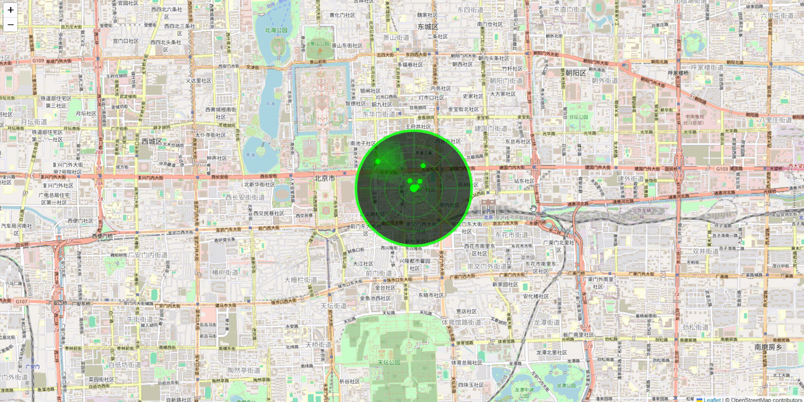

# L.RadarScan - Radar Scanning Plugin

A powerful Leaflet plugin for creating realistic radar scanning effects. Features classic radar screen display, data point detection, rich style customization, and map zoom adaptation.

## Demo

**[Live Demo](https://giserlk360.github.io/leaflet-radar-scan)** - Try it now!



## Installation

### Method 1: Direct Download

1. Download plugin files:
   - `L.RadarScan.js` - Core plugin file
   - `L.RadarScan.css` - Style file

2. Include in HTML:

```html
<!-- Leaflet CSS -->
<link rel="stylesheet" href="https://unpkg.com/leaflet@1.9.4/dist/leaflet.css" />

<!-- Radar Scan Plugin CSS -->
<link rel="stylesheet" href="L.RadarScan.css" />

<!-- Leaflet JS -->
<script src="https://unpkg.com/leaflet@1.9.4/dist/leaflet.js"></script>

<!-- Radar Scan Plugin JS -->
<script src="L.RadarScan.js"></script>
```

### Method 2: Using npm

1. Install the plugin:

```bash
npm install leaflet-radar-scan
```

2. Import in your project:

```javascript
// Import Leaflet
import L from 'leaflet';
import 'leaflet/dist/leaflet.css';

// Import radar scan plugin
import 'leaflet-radar-scan';
import 'leaflet-radar-scan/L.RadarScan.css';
```

## Basic Usage

```javascript
// Create map
const map = L.map('map').setView([39.9042, 116.4074], 12);

// Add tile layer
L.tileLayer('https://{s}.tile.openstreetmap.org/{z}/{x}/{y}.png').addTo(map);

// Create radar scan
const radarScan = L.radarScan({
    center: [39.9042, 116.4074],
    radius: 2000,
    sweepAngle: 60,
    animationDuration: 3000
}).addTo(map);

// Add data point
radarScan.addDataPoint([39.9042, 116.4074], { id: 1, name: 'Target 1' });

// Start scanning
radarScan.startScan();
```

## Style Customization

### Background Circle Style

```javascript
const radarScan = L.radarScan({
    backgroundCircleOptions: {
        fill: 'rgba(0, 20, 0, 0.9)',
        stroke: '#00ff00',
        strokeWidth: 2,
        strokeDasharray: '10,5', // Dash pattern
        opacity: 0.8,
        radius: 45
    }
});
```

### Range Rings Style

```javascript
const radarScan = L.radarScan({
    rangeRingOptions: {
        stroke: '#00ff00',
        strokeWidth: 1,
        strokeDasharray: '5,3',
        opacity: 0.6,
        fill: 'none',
        // Individual styles for each ring
        individualStyles: [
            { opacity: 0.8 },
            { opacity: 0.6 },
            { opacity: 0.4 },
            { opacity: 0.2 }
        ]
    }
});
```

### Bearing Lines Style

```javascript
const radarScan = L.radarScan({
    bearingLineOptions: {
        stroke: '#00ff00',
        strokeWidth: 1,
        strokeDasharray: '3,2',
        opacity: 0.5,
        innerRadius: 5,
        outerRadius: 45,
        // Individual styles for each line
        individualStyles: [
            { stroke: '#ff0000' },
            { stroke: '#00ff00' }
        ]
    }
});
```

### Center Point Style

```javascript
const radarScan = L.radarScan({
    centerPointOptions: {
        fill: '#00ff00',
        stroke: '#ffffff',
        strokeWidth: 1,
        radius: 3,
        opacity: 1,
        // Glow effect
        glow: {
            enabled: true,
            color: '#00ff00',
            blur: 5,
            spread: 0
        },
        // Pulse effect
        pulse: {
            enabled: true,
            duration: 2000,
            minOpacity: 0.3,
            maxOpacity: 1
        }
    }
});
```

### Sweep Sector Style

```javascript
const radarScan = L.radarScan({
    sweepOptions: {
        color: '#00ff00',
        opacity: 0.6,
        // Gradient configuration
        gradient: {
            enabled: true,
            centerOpacity: 0.8,
            edgeOpacity: 0,
            type: 'radial'
        },
        // Trail effect
        trail: {
            enabled: true,
            length: 90, // Trail length in degrees
            opacity: 0.3
        }
    }
});
```

### Individual Color Settings

Each radar element can be styled independently:

```javascript
// Set background circle color individually
radarScan.updateBackgroundCircleStyle({
    stroke: '#ff0000'  // Red background circle
});

// Set range rings color individually
radarScan.updateRangeRingStyle({
    stroke: '#00ff00'  // Green range rings
});

// Set bearing lines color individually
radarScan.updateBearingLineStyle({
    stroke: '#0000ff'  // Blue bearing lines
});

// Set center point color individually
radarScan.updateCenterPointStyle({
    fill: '#ffff00',           // Yellow fill
    glow: { color: '#ffff00' } // Yellow glow
});

// Set sweep sector color individually
radarScan.updateSweepStyle({
    color: '#ff00ff',          // Purple sweep sector
    opacity: 0.7,              // Opacity
    gradient: {
        enabled: true,
        centerOpacity: 0.9,
        edgeOpacity: 0.1
    }
});

// Batch set different colors
radarScan.updateAllStyles({
    backgroundCircle: { stroke: '#ff4444' },
    rangeRings: { stroke: '#44ff44' },
    bearingLines: { stroke: '#4444ff' },
    centerPoint: {
        fill: '#ffff44',
        glow: { color: '#ffff44' }
    },
    sweep: {
        color: '#ff44ff',
        opacity: 0.7
    }
});
```

## API Reference

### Constructor

```javascript
L.radarScan(options)
```

### Main Configuration Options

| Option | Type | Default | Description |
|--------|------|---------|-------------|
| `center` | Array | null | Radar center coordinates [lat, lng] |
| `radius` | Number | 1000 | Scan radius in meters |
| `sweepAngle` | Number | 60 | Sweep sector angle in degrees |
| `animationDuration` | Number | 3000 | Time for one complete scan in milliseconds |
| `showGrid` | Boolean | true | Whether to show grid |
| `showRangeRings` | Boolean | true | Whether to show range rings |
| `showBearingLines` | Boolean | true | Whether to show bearing lines |
| `rangeRings` | Number | 4 | Number of range rings |
| `bearingLines` | Number | 8 | Number of bearing lines |
| `radarColor` | String | '#00ff00' | Main radar color |

### Methods

#### Scan Control

```javascript
radarScan.startScan()        // Start scanning
radarScan.stopScan()         // Stop scanning
radarScan.resetScan()        // Reset scan state
```

#### Data Point Management

```javascript
// Add data point
const marker = radarScan.addDataPoint([lat, lng], data, options);

// Remove data point
radarScan.removeDataPoint(marker);

// Clear all data points
radarScan.clearDataPoints();
```

#### Style Updates

```javascript
// Update background circle style
radarScan.updateBackgroundCircleStyle({
    stroke: '#ff0000',
    strokeWidth: 3
});

// Update range rings style
radarScan.updateRangeRingStyle({
    stroke: '#0000ff',
    opacity: 0.8
});

// Update bearing lines style
radarScan.updateBearingLineStyle({
    strokeDasharray: '5,5'
});

// Update center point style
radarScan.updateCenterPointStyle({
    radius: 5,
    glow: { enabled: true, blur: 8 }
});

// Update sweep style
radarScan.updateSweepStyle({
    color: '#ff00ff',
    opacity: 0.8,
    gradient: {
        enabled: true,
        centerOpacity: 0.9,
        edgeOpacity: 0.2
    }
});

// Batch update all styles
radarScan.updateAllStyles({
    backgroundCircle: { stroke: '#ff0000' },
    rangeRings: { opacity: 0.8 },
    bearingLines: { strokeWidth: 2 },
    centerPoint: { radius: 4 },
    sweep: {
        color: '#00ffff',
        opacity: 0.7
    }
});
```

#### Configuration Management

```javascript
// Get current style configuration
const config = radarScan.getStyleConfig();

// Set center point and radius
radarScan.setCenter([lat, lng]);
radarScan.setRadius(3000);
```

### Events

```javascript
radarScan.on('scanstart', function() {
    console.log('Scan started');
});

radarScan.on('scanstop', function() {
    console.log('Scan stopped');
});

radarScan.on('scancomplete', function() {
    console.log('Scan cycle completed');
});

radarScan.on('pointscanned', function(e) {
    console.log('Point scanned:', e.point, e.data);
});
```

## 📄 License

MIT License

## 🤝 Contributing

Issues and Pull Requests are welcome!

## 🌐 Language

- [中文文档](README_zh.md)
- [English Documentation](README.md)