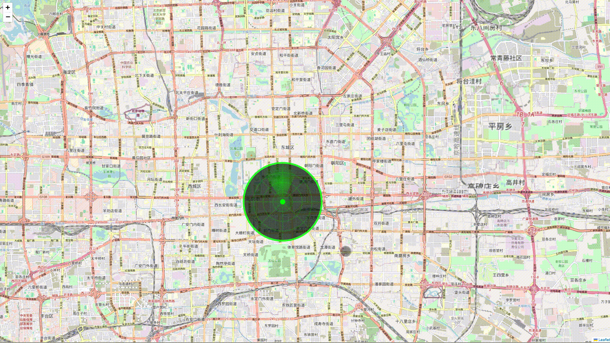

# L.RadarScan - 雷达扫描插件

一个功能强大的 Leaflet 插件，用于创建逼真的雷达扫描效果。支持经典雷达屏幕显示、数据点检测、丰富的样式定制和地图缩放自适应。

## 效果展示



### 安装

#### 方法一：直接下载

1. 下载插件文件：
   - `L.RadarScan.js` - 核心插件文件
   - `L.RadarScan.css` - 样式文件

2. 在 HTML 中引入：

```html
<!-- Leaflet CSS -->
<link rel="stylesheet" href="https://unpkg.com/leaflet@1.9.4/dist/leaflet.css" />

<!-- 雷达扫描插件 CSS -->
<link rel="stylesheet" href="L.RadarScan.css" />

<!-- Leaflet JS -->
<script src="https://unpkg.com/leaflet@1.9.4/dist/leaflet.js"></script>

<!-- 雷达扫描插件 JS -->
<script src="L.RadarScan.js"></script>
```

#### 方法二：使用 npm

1. 安装插件：

```bash
npm install leaflet-radar-scan
```

2. 在项目中引入：

```javascript
// 引入 Leaflet
import L from 'leaflet';
import 'leaflet/dist/leaflet.css';

// 引入雷达扫描插件
import 'leaflet-radar-scan';
import 'leaflet-radar-scan/L.RadarScan.css';
```

### 基础使用

```javascript
// 创建地图
const map = L.map('map').setView([39.9042, 116.4074], 12);

// 添加地图图层
L.tileLayer('https://{s}.tile.openstreetmap.org/{z}/{x}/{y}.png').addTo(map);

// 创建雷达扫描
const radarScan = L.radarScan({
    center: [39.9042, 116.4074],
    radius: 2000,
    sweepAngle: 60,
    animationDuration: 3000
}).addTo(map);

// 添加数据点
radarScan.addDataPoint([39.9042, 116.4074], { id: 1, name: '目标1' });

// 开始扫描
radarScan.startScan();
```

## 样式定制

### 外圆（背景圆）样式

```javascript
const radarScan = L.radarScan({
    backgroundCircleOptions: {
        fill: 'rgba(0, 20, 0, 0.9)',
        stroke: '#00ff00',
        strokeWidth: 2,
        strokeDasharray: '10,5', // 虚线样式
        opacity: 0.8,
        radius: 45
    }
});
```

### 同心圆样式

```javascript
const radarScan = L.radarScan({
    rangeRingOptions: {
        stroke: '#00ff00',
        strokeWidth: 1,
        strokeDasharray: '5,3',
        opacity: 0.6,
        fill: 'none',
        // 为每个圆圈设置不同样式
        individualStyles: [
            { opacity: 0.8 },
            { opacity: 0.6 },
            { opacity: 0.4 },
            { opacity: 0.2 }
        ]
    }
});
```

### 方位线样式

```javascript
const radarScan = L.radarScan({
    bearingLineOptions: {
        stroke: '#00ff00',
        strokeWidth: 1,
        strokeDasharray: '3,2',
        opacity: 0.5,
        innerRadius: 5,
        outerRadius: 45,
        // 为每条线设置不同样式
        individualStyles: [
            { stroke: '#ff0000' },
            { stroke: '#00ff00' }
        ]
    }
});
```

### 中心点样式

```javascript
const radarScan = L.radarScan({
    centerPointOptions: {
        fill: '#00ff00',
        stroke: '#ffffff',
        strokeWidth: 1,
        radius: 3,
        opacity: 1,
        // 发光效果
        glow: {
            enabled: true,
            color: '#00ff00',
            blur: 5,
            spread: 0
        },
        // 脉冲效果
        pulse: {
            enabled: true,
            duration: 2000,
            minOpacity: 0.3,
            maxOpacity: 1
        }
    }
});
```

### 扫描扇形样式

```javascript
const radarScan = L.radarScan({
    sweepOptions: {
        color: '#00ff00',
        opacity: 0.6,
        // 渐变配置
        gradient: {
            enabled: true,
            centerOpacity: 0.8,
            edgeOpacity: 0,
            type: 'radial'
        },
        // 尾迹效果
        trail: {
            enabled: true,
            length: 90, // 尾迹长度（度）
            opacity: 0.3
        }
    }
});
```

### 独立颜色设置

每个雷达元素都可以单独设置颜色：

```javascript
// 单独设置外圆颜色
radarScan.updateBackgroundCircleStyle({
    stroke: '#ff0000'  // 红色外圆
});

// 单独设置同心圆颜色
radarScan.updateRangeRingStyle({
    stroke: '#00ff00'  // 绿色同心圆
});

// 单独设置方位线颜色
radarScan.updateBearingLineStyle({
    stroke: '#0000ff'  // 蓝色方位线
});

// 单独设置中心点颜色
radarScan.updateCenterPointStyle({
    fill: '#ffff00',           // 黄色填充
    glow: { color: '#ffff00' } // 黄色发光
});

// 单独设置扫描扇形颜色
radarScan.updateSweepStyle({
    color: '#ff00ff',          // 紫色扫描扇形
    opacity: 0.7,              // 透明度
    gradient: {
        enabled: true,
        centerOpacity: 0.9,
        edgeOpacity: 0.1
    }
});

// 批量设置不同颜色
radarScan.updateAllStyles({
    backgroundCircle: { stroke: '#ff4444' },
    rangeRings: { stroke: '#44ff44' },
    bearingLines: { stroke: '#4444ff' },
    centerPoint: {
        fill: '#ffff44',
        glow: { color: '#ffff44' }
    },
    sweep: {
        color: '#ff44ff',
        opacity: 0.7
    }
});
```

## API 参考

### 构造函数

```javascript
L.radarScan(options)
```

### 主要配置选项

| 选项 | 类型 | 默认值 | 描述 |
|------|------|--------|------|
| `center` | Array | null | 雷达中心点坐标 [lat, lng] |
| `radius` | Number | 1000 | 扫描半径（米） |
| `sweepAngle` | Number | 60 | 扫描扇形角度（度） |
| `animationDuration` | Number | 3000 | 一圈扫描时间（毫秒） |
| `showGrid` | Boolean | true | 是否显示网格 |
| `showRangeRings` | Boolean | true | 是否显示同心圆 |
| `showBearingLines` | Boolean | true | 是否显示方位线 |
| `rangeRings` | Number | 4 | 同心圆数量 |
| `bearingLines` | Number | 8 | 方位线数量 |
| `radarColor` | String | '#00ff00' | 雷达主色调 |

### 方法

#### 扫描控制

```javascript
radarScan.startScan()        // 开始扫描
radarScan.stopScan()         // 停止扫描
radarScan.resetScan()        // 重置扫描状态
```

#### 数据点管理

```javascript
// 添加数据点
const marker = radarScan.addDataPoint([lat, lng], data, options);

// 移除数据点
radarScan.removeDataPoint(marker);

// 清除所有数据点
radarScan.clearDataPoints();
```

#### 样式更新

```javascript
// 更新背景圆样式
radarScan.updateBackgroundCircleStyle({
    stroke: '#ff0000',
    strokeWidth: 3
});

// 更新同心圆样式
radarScan.updateRangeRingStyle({
    stroke: '#0000ff',
    opacity: 0.8
});

// 更新方位线样式
radarScan.updateBearingLineStyle({
    strokeDasharray: '5,5'
});

// 更新中心点样式
radarScan.updateCenterPointStyle({
    radius: 5,
    glow: { enabled: true, blur: 8 }
});

// 更新扫描扇形样式
radarScan.updateSweepStyle({
    color: '#ff00ff',
    opacity: 0.8,
    gradient: {
        enabled: true,
        centerOpacity: 0.9,
        edgeOpacity: 0.2
    }
});

// 批量更新所有样式
radarScan.updateAllStyles({
    backgroundCircle: { stroke: '#ff0000' },
    rangeRings: { opacity: 0.8 },
    bearingLines: { strokeWidth: 2 },
    centerPoint: { radius: 4 },
    sweep: {
        color: '#00ffff',
        opacity: 0.7
    }
});
```

#### 配置管理

```javascript
// 获取当前样式配置
const config = radarScan.getStyleConfig();

// 设置中心点和半径
radarScan.setCenter([lat, lng]);
radarScan.setRadius(3000);
```

### 事件

```javascript
radarScan.on('scanstart', function() {
    console.log('扫描开始');
});

radarScan.on('scanstop', function() {
    console.log('扫描停止');
});

radarScan.on('scancomplete', function() {
    console.log('完成一轮扫描');
});

radarScan.on('pointscanned', function(e) {
    console.log('扫描到数据点:', e.point, e.data);
});
```

## 📄 许可证

MIT License

## 🤝 贡献

欢迎提交 Issue 和 Pull Request！

